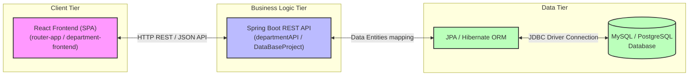
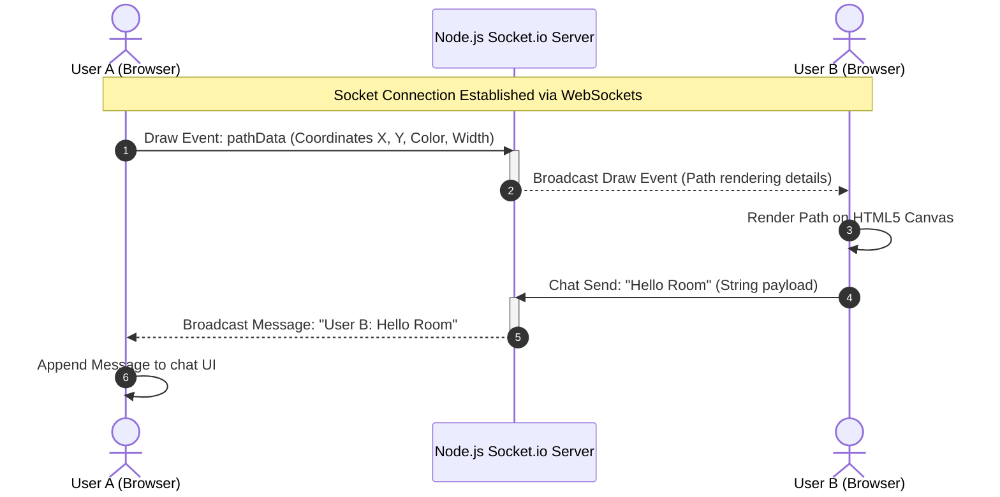
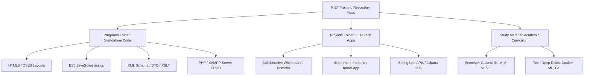

# Noida Institute of Engineering & Technology (NIET)
## 🎓 Computer Science & Engineering Department
### 🌐 Comprehensive Web Technology & Engineering Training Hub (Semesters III - VIII)

Welcome to the central repository for **Keshab Kumar's** engineering training, coursework, projects, and academic resources at **Noida Institute of Engineering and Technology (NIET)**, Greater Noida. 

This repository serves as a state-of-the-art archive of academic materials and hands-on software development projects, spanning **Semester III through Semester VIII (2022–2026 Batch)**, with a major focus on full-stack web development, software engineering, databases, and containerized architectures.

---

## 📊 Repository Badges


---

## 🗺️ Architectural Workflow Diagrams

### 1. Full-Stack Web Architecture (React & Spring Boot)
This diagram illustrates the structure of the **Department Management** full-stack system within the repository:



---

### 2. Real-Time Collaborative WebSockets Workflow (Whiteboard App)
The workflow of the **Socket.io Collaborative Whiteboard & Chat** application:



---

### 3. Repository Directory Mapping
A structural view of how research notes, standalone scripts, and advanced projects are divided:



---

## 🗂️ Detailed Directory Directory

| High-Level Path | Category | Description | Primary Technology |
| :--- | :--- | :--- | :--- |
| **[`Programs/`](file:///d:/Web%20Development/Web-Technology-Training-NIET/Programs)** | Standalone Code | 190+ standalone code labs representing weekly training assignments. Includes CSS styling, DOM scripts, XML parsers, and PHP sessions/cookies. | HTML, CSS, JS, PHP, XML |
| **[`Programs/PHP Program run on XAMPP/`](file:///d:/Web%20Development/Web-Technology-Training-NIET/Programs/PHP%20Program%20run%20on%20XAMPP)** | PHP / Backend | Database connection handlers, form uploads, cookies, session tracking, and user login templates. | PHP, MySQL, XAMPP |
| **[`Projects/`](file:///d:/Web%20Development/Web-Technology-Training-NIET/Projects)** | Web Applications | Complex production-ready projects and single-page applications. | React, Spring Boot, Node, Socket.io |
| **[`Study Material/`](file:///d:/Web%20Development/Web-Technology-Training-NIET/Study%20Material)** | Academic Guides | Reference notes, textbooks, badging materials, curriculum, and semester guides. | Markdown, PDF, PPTX, DOCX |

---

## 🎓 Semester-Wise Academic Breakdown

### 📂 Semester III & Semester IV
*   **Path**: [`Study Material/3RD SEMESTER/`](file:///d:/Web%20Development/Web-Technology-Training-NIET/Study%20Material/3RD%20SEMESTER) and [`Study Material/Semester 4/`](file:///d:/Web%20Development/Web-Technology-Training-NIET/Study%20Material/Semester%204)
*   **Focus**: Fundamental concepts of Object-Oriented Programming, Data Structures, Algorithms, and Core Math.

### 📂 Semester V (Training Focus)
*   **Path**: [`Study Material/Vth Semester/`](file:///d:/Web%20Development/Web-Technology-Training-NIET/Study%20Material/Vth%20Semester)
*   **Focus**: Complete professional web technology training. Includes:
    *   **Django Web Framework**: Step-by-step video lecture modules and templates for backend routing, forms, views, models, and template inheritances in Python.
    *   **DBMS & Databases**: Detailed slides from Oracle Academy, sessional papers, query labs, and custom SQL dumps (`Experiment1.sql` to `Experiment11.sql`).
    *   **Design Thinking II**: Presentation slides detailing design modeling, wireframing, and user-centric prototyping.
    *   **Design Patterns**: Gang of Four (GoF) structural, creational, and behavioral patterns.

### 📂 Semester VI
*   **Path**: [`Study Material/SEM VI/`](file:///d:/Web%20Development/Web-Technology-Training-NIET/Study%20Material/SEM%20VI)
*   **Focus**: Full Stack Engineering and System Modeling.
    *   **MEAN Stack**: Single Page Application development using Angular, Node, Express, MongoDB, and TypeScript.
    *   **Software Engineering Diagrams**: Professional system structure mappings using StarUML (`.mdj` file formats) for Class, Component, Communication, and Entity-Relationship modeling.

### 📂 Semester VIII
*   **Path**: [`Study Material/8th semester/`](file:///d:/Web%20Development/Web-Technology-Training-NIET/Study%20Material/8th%20semester)
*   **Focus**: Professional engineering disciplines.
    *   **Human Psychology**: Course documents on cognitive behavioral studies.
    *   **Software Engineering**: Advanced software modeling, testing strategies, and project management.

---

## 🚀 Featured Web Projects

### 🎨 1. Real-Time Collaborative Whiteboard
*   **Location**: [`Projects/White board/`](file:///d:/Web%20Development/Web-Technology-Training-NIET/Projects/White%20board)
*   **Description**: A collaborative multiplayer canvas whiteboard where multiple users can paint and chat in real-time. Supports canvas drawings broadcasting, color palette switching, line weight adjustment, and light/dark mode.
*   **Stack**: Node.js, Express, Socket.io (WebSockets), HTML5 Canvas API, Vanilla CSS.

### 🏢 2. Department Management System (React + Spring Boot API)
*   **Location**: [`Projects/department-frontend/`](file:///d:/Web%20Development/Web-Technology-Training-NIET/Projects/department-frontend) and [`Projects/departmentAPI/`](file:///d:/Web%20Development/Web-Technology-Training-NIET/Projects/departmentAPI)
*   **Description**: A CRUD system to add, view, list, and modify company departments, using React.js for the dynamic interface and Spring Boot as the backend server.
*   **Stack**: React.js (Hooks, state, fetch client), Spring Boot (Spring JPA, REST APIs), Hibernate, MySQL.

### 🍃 3. Spring Boot JPA & Hibernate Crud Labs
*   **Location**: [`Projects/JakartaDatabse/`](file:///d:/Web%20Development/Web-Technology-Training-NIET/Projects/Jakarta%20Database) and [`Projects/DataBaseProject/`](file:///d:/Web%20Development/Web-Technology-Training-NIET/Projects/DataBaseProject)
*   **Description**: Object-Relational Mapping (ORM) Java applications using standard Jakarta Persistence API and Spring Data JPA repositories.

---

## 📊 Full Technology Stack Matrix

| Technology | Category | Location inside Repository | Description |
| :--- | :--- | :--- | :--- |
| **Java / Spring Boot** | Backend Web API | [`Projects/SpringBoot/`](file:///d:/Web%20Development/Web-Technology-Training-NIET/Projects/SpringBoot), [`Projects/departmentAPI/`](file:///d:/Web%20Development/Web-Technology-Training-NIET/Projects/departmentAPI) | REST API Controllers, Dependency Injection, JPA Hibernate Entities, Maven Builds |
| **React.js** | Frontend SPA | [`Projects/department-frontend/`](file:///d:/Web%20Development/Web-Technology-Training-NIET/Projects/department-frontend), [`Projects/router-app/`](file:///d:/Web%20Development/Web-Technology-Training-NIET/Projects/router-app) | Component states, single-page application routing, hooks, API fetchers |
| **Django** | Python Backend | [`Study Material/Vth Semester/Django/`](file:///d:/Web%20Development/Web-Technology-Training-NIET/Study%20Material/Vth%20Semester/Django) | Views, Django ORM, HTML template rendering, user login authentication |
| **Node.js / Express**| WebSocket Server | [`Projects/White board/`](file:///d:/Web%20Development/Web-Technology-Training-NIET/Projects/White%20board), [`Study Material/Node/`](file:///d:/Web%20Development/Web-Technology-Training-NIET/Study%20Material/Node) | Group socket event broadcasting, server-side HTTP listener setup |
| **TypeScript** | Strict Typing | [`Study Material/TypeScript/`](file:///d:/Web%20Development/Web-Technology-Training-NIET/Study%20Material/TypeScript), [`Study Material/SEM VI/TYPESCRIPT`](file:///d:/Web%20Development/Web-Technology-Training-NIET/Study%20Material/SEM%20VI/TYPESCRIPT) | Typing, interfaces, compiler configurations, MEAN stack programming |
| **PHP** | Server Scripting | [`Programs/PHP Program run on XAMPP/`](file:///d:/Web%20Development/Web-Technology-Training-NIET/Programs/PHP%20Program%20run%20on%20XAMPP), [`Study Material/PHP/`](file:///d:/Web%20Development/Web-Technology-Training-NIET/Study%20Material/PHP) | Cookies, session trackers, file uploads, database queries |
| **HTML5 / CSS3** | Frontend UI | [`Programs/`](file:///d:/Web%20Development/Web-Technology-Training-NIET/Programs), [`Study Material/CSS/`](file:///d:/Web%20Development/Web-Technology-Training-NIET/Study%20Material/CSS) | Border radius, float layout, margin, padding, flexbox, custom grid structures |
| **XML / DTD / XSD** | Schema Validation | [`Programs/`](file:///d:/Web%20Development/Web-Technology-Training-NIET/Programs), [`Study Material/XML/`](file:///d:/Web%20Development/Web-Technology-Training-NIET/Study%20Material/XML) | DTD/XSD validation schemas, XSLT stylesheet parsing |
| **Databases** | Relational & NoSQL| [`Study Material/MySQL/`](file:///d:/Web%20Development/Web-Technology-Training-NIET/Study%20Material/MySQL), [`Study Material/MongoDb/`](file:///d:/Web%20Development/Web-Technology-Training-NIET/Study%20Material/MongoDb) | SQL queries, DBMS triggers, relational indexing, MongoDB NoSQL collections |
| **Machine Learning**| Python AI | [`Study Material/Machine learning/`](file:///d:/Web%20Development/Web-Technology-Training-NIET/Study%20Material/Machine%20learning) | Regression/classification models using Scikit-Learn, NumPy, Pandas datasets |
| **Docker** | Containerization | [`Study Material/Docker/`](file:///d:/Web%20Development/Web-Technology-Training-NIET/Study%20Material/Docker) | Dockerfiles, multi-stage building, volume mapping, containers |

---

## 🔧 Installation & Getting Started

### Running the Real-Time Collaborative Whiteboard
1.  Navigate into the project directory:
    ```bash
    cd "Projects/White board"
    ```
2.  Install dependencies:
    ```bash
    npm install
    ```
3.  Start the application:
    ```bash
    node client.js
    ```
4.  Open `http://localhost:3000` in multiple browser windows to test real-time collaboration.

### Running a Spring Boot Project
1.  Navigate into a Spring Boot folder (e.g. `Projects/departmentAPI`):
    ```bash
    cd "Projects/departmentAPI"
    ```
2.  Build and run the project:
    ```bash
    mvn spring-boot:run
    ```

### Running React Applications
1.  Navigate into the React folder (e.g. `Projects/department-frontend`):
    ```bash
    cd "Projects/department-frontend"
    ```
2.  Install packages:
    ```bash
    npm install
    ```
3.  Run the development server:
    ```bash
    npm start
    ```

---

## 🌟 Mentorship & Acknowledgements
I express my deepest gratitude to my instructors and mentors for their guidance during my web technology training and engineering courses:
*   **Rajat Kumar Sir** (Trainer and Mentor)
    *   **YouTube**: [Tech Learning with Rajat](https://www.youtube.com/@techlearningwithRajat)
    *   **LinkedIn**: [Rajat Kumar](https://www.linkedin.com/in/rajat-kumar-789826120/)
*   **N Noida Institute of Engineering & Technology (NIET) CSE Faculty**

---

## ✉️ Contact & Support

*   **Developer**: Keshab Kumar
*   **Email**: [keshabkumarjha876@gmail.com](mailto:keshabkumarjha876@gmail.com)
*   **LinkedIn**: [Keshab Kumar](https://www.linkedin.com/in/keshabkjha)
*   **Linktree**: [Linktree Profile](https://linktr.ee/Keshabkjha)

If you find this repository helpful, please consider giving it a **Star** ⭐ on GitHub to show your support!
